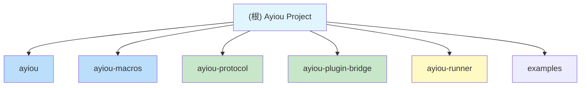
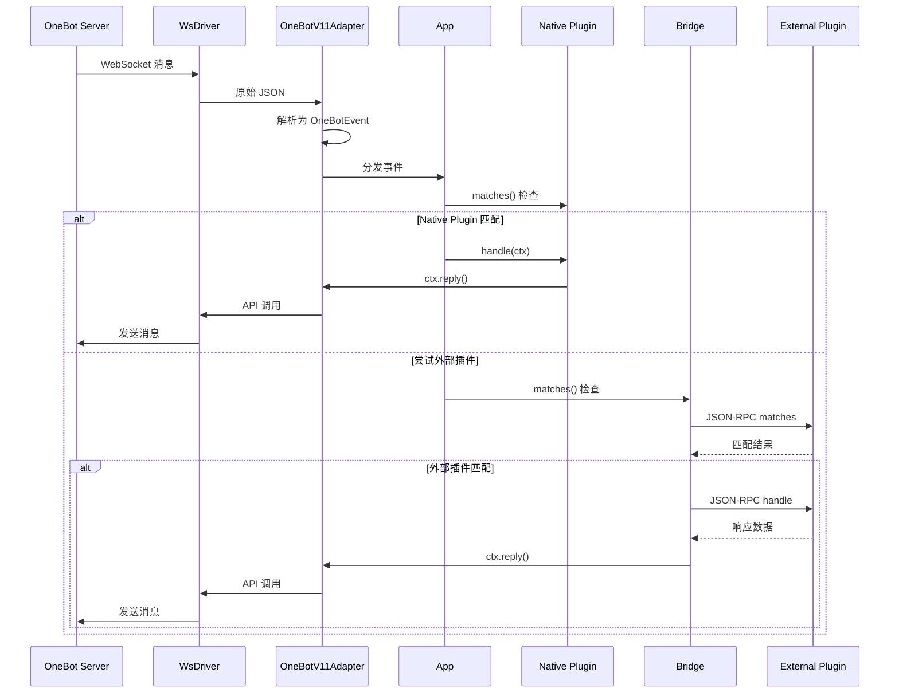

# Ayiou

> 基于 Rust 的 OneBot v11 机器人框架，支持插件化命令处理和宏驱动开发

**最后更新**: 2025-12-15 21:16:40

## 变更日志 (Changelog)

### 2025-12-15
- 新增 `ayiou-protocol` 模块：外部插件 JSON-RPC 协议定义
- 新增 `ayiou-plugin-bridge` 模块：多语言外部插件桥接支持
- 新增 `ayiou-runner` 模块：完整的机器人运行器
- 增强插件生命周期：新增 `build()`, `ready()`, `finish()`, `cleanup()` 钩子
- 新增 `AppBuilder` 架构：支持依赖注入、配置管理和资源共享
- 新增全局 `LifecycleDriver`：支持 `on_startup()` 和 `on_shutdown()` 钩子

### 2025-12-14
- 初始版本发布
- 实现核心 Plugin 系统和 OneBot v11 适配器
- 实现派生宏 `#[derive(Plugin)]` 和 `#[derive(Args)]`

## 项目概述

Ayiou 是一个轻量级、高性能的 QQ 机器人框架，基于 OneBot v11 协议，采用 Rust 编写。框架提供了强大的派生宏系统和多语言插件支持，让开发者可以使用 Rust、Python、JavaScript、Go 等任意语言编写插件。

### 核心特性

- **插件化架构**: 基于 trait 的插件系统，支持生命周期管理和依赖注入
- **派生宏驱动**: `#[derive(Plugin)]` 和 `#[derive(Args)]` 简化命令定义
- **多语言支持**: 通过 JSON-RPC 协议支持 Python、JavaScript、Go 等外部插件
- **异步运行时**: 基于 Tokio 的全异步设计
- **WebSocket 传输**: 支持自动重连的 WebSocket 客户端
- **配置管理**: TOML 配置系统，支持热重载和类型安全
- **资源共享**: 依赖注入系统，插件间共享资源
- **类型安全**: 完整的 OneBot v11 事件模型类型定义

## 模块结构图



## 模块索引

| 模块 | 路径 | 说明 |
|------|------|------|
| [ayiou](./ayiou/CLAUDE.md) | `ayiou/` | 核心运行时库，提供插件系统、OneBot 适配器和 WebSocket 驱动 |
| [ayiou-macros](./ayiou-macros/CLAUDE.md) | `ayiou-macros/` | 派生宏实现，提供 `#[derive(Plugin)]` 和 `#[derive(Args)]` |
| [ayiou-protocol](./ayiou-protocol/CLAUDE.md) | `ayiou-protocol/` | 外部插件 JSON-RPC 协议定义 |
| [ayiou-plugin-bridge](./ayiou-plugin-bridge/CLAUDE.md) | `ayiou-plugin-bridge/` | 多语言外部插件桥接，支持 Python/JS/Go 等 |
| [ayiou-runner](./ayiou-runner/CLAUDE.md) | `ayiou-runner/` | 完整的机器人运行器，开箱即用 |

## 架构概览

```mermaid
graph TB
    subgraph "用户代码层"
        UC[用户插件/命令]
        ExtPlugin[外部插件<br/>Python/JS/Go]
    end

    subgraph "ayiou 核心库"
        AB[AyiouBot]
        AppBuilder[AppBuilder<br/>应用构建器]

        subgraph "core 模块"
            Plugin[Plugin Trait]
            Args[Args Trait]
            Lifecycle[生命周期管理]
            Config[配置系统]
            Resource[资源注册表]
        end

        subgraph "adapter 模块"
            OB11[OneBotV11Adapter]
            CTX[Ctx 上下文]
            Model[OneBot 数据模型]
        end

        subgraph "driver 模块"
            WS[WsDriver]
            Driver[Driver Trait]
        end
    end

    subgraph "ayiou-macros 宏库"
        DPlugin[#[derive Plugin]]
        DArgs[#[derive Args]]
        Attrs[属性解析]
    end

    subgraph "ayiou-plugin-bridge"
        Bridge[ExternalPluginBridge]
        Process[进程管理]
        RPC[JSON-RPC 通信]
    end

    subgraph "ayiou-protocol"
        Protocol[协议定义]
        Messages[消息类型]
    end

    subgraph "外部服务"
        OneBot[OneBot 实现<br/>如 go-cqhttp]
    end

    UC --> DPlugin
    UC --> DArgs
    DPlugin --> Attrs
    DArgs --> Attrs

    UC --> AB
    AB --> AppBuilder
    AppBuilder --> Plugin
    AppBuilder --> Config
    AppBuilder --> Resource

    AB --> OB11
    OB11 --> WS
    WS --> Driver
    WS <--> OneBot

    OB11 --> CTX
    CTX --> Model
    Plugin --> CTX

    ExtPlugin -.->|stdio| Bridge
    Bridge --> Process
    Bridge --> RPC
    RPC --> Protocol
    Bridge --> Plugin
```

## 数据流



## 快速开始

### 原生 Rust 插件

```rust
use ayiou::prelude::*;

#[derive(Plugin)]
#[plugin(prefix = "/", description = "示例插件")]
pub enum MyCommands {
    #[plugin(description = "显示帮助")]
    Help,

    #[plugin(description = "回显消息")]
    Echo(EchoArgs),
}

#[derive(Args)]
pub struct EchoArgs {
    #[arg(rest)]
    pub text: String,
}

impl EchoArgs {
    pub async fn handle(&self, ctx: &Ctx) -> anyhow::Result<()> {
        ctx.reply_text(&self.text).await
    }
}

#[tokio::main]
async fn main() {
    AyiouBot::new()
        .command::<MyCommands>()
        .run("ws://127.0.0.1:8080")
        .await;
}
```

### 外部插件（Python 示例）

```python
#!/usr/bin/env python3
import json
import sys

def handle_request(method, params):
    if method == "metadata":
        return {
            "name": "weather",
            "description": "天气查询插件",
            "version": "1.0.0",
            "commands": [
                {"name": "weather", "description": "查询天气"}
            ]
        }
    elif method == "matches":
        return {"matches": params["text"].startswith("/weather")}
    elif method == "handle":
        return {
            "handled": True,
            "block": True,
            "reply": f"天气信息: {params['text']}"
        }
    return None

# JSON-RPC 主循环
for line in sys.stdin:
    req = json.loads(line)
    result = handle_request(req["method"], req.get("params", {}))
    response = {"jsonrpc": "2.0", "result": result, "id": req["id"]}
    print(json.dumps(response), flush=True)
```

配置文件 `config.toml`:

```toml
[external-plugin-bridge]
enabled = true

[external-plugin-bridge.plugins.weather]
command = "python3"
args = ["plugins/weather.py"]
```

## 运行与开发

### 构建项目

```bash
# 构建所有 crate
cargo build

# 构建发布版本
cargo build --release

# 构建特定模块
cargo build -p ayiou
cargo build -p ayiou-runner
```

### 运行示例

```bash
# 运行原生插件示例
cargo run --example native_demo

# 运行外部插件桥接示例
cargo run -p ayiou-plugin-bridge --example demo

# 运行完整机器人
cargo run -p ayiou-runner
```

### 测试

```bash
# 运行所有测试
cargo test

# 运行特定模块测试
cargo test -p ayiou

# 运行带输出的测试
cargo test -- --nocapture
```

### 代码质量

```bash
# 代码检查
cargo clippy

# 格式化
cargo fmt

# 检查文档
cargo doc --no-deps --open
```

## 测试策略

### 单元测试
- 每个模块的核心逻辑包含单元测试
- 测试覆盖：参数解析、配置加载、资源管理
- 位置：各模块 `src/` 目录下的 `#[cfg(test)]` 模块

### 集成测试
- 完整的插件生命周期测试
- OneBot 协议消息解析测试
- 外部插件 JSON-RPC 通信测试

### 示例作为测试
- `examples/` 目录下的示例同时作为集成测试
- `native_demo.rs`: 测试原生插件系统和生命周期
- `demo.rs` (bridge): 测试外部插件加载和通信

## 编码规范

### Rust 规范
- **Edition**: 2024
- **错误处理**: 使用 `anyhow::Result` 进行错误传播，库代码使用 `thiserror`
- **异步**: 所有 I/O 操作使用 async/await
- **命名**: 遵循 Rust 标准命名约定
  - `snake_case`: 函数、变量、模块
  - `PascalCase`: 类型、Trait、枚举
  - `SCREAMING_SNAKE_CASE`: 常量
- **文档**: 公共 API 必须有文档注释（`///`）
- **模块组织**: 使用 `mod.rs` 或同名文件作为模块入口

### 插件开发规范
1. 实现 `Plugin` trait 的所有必需方法
2. 使用 `PluginMetadata` 提供元信息
3. 通过 `dependencies()` 声明依赖关系
4. 使用 `#[derive(Plugin)]` 简化命令插件开发
5. 配置通过 `Configurable` trait 实现类型安全

### 外部插件规范
1. 遵循 JSON-RPC 2.0 协议
2. 实现 `metadata`, `matches`, `handle` 方法
3. 通过 stdio 进行通信（逐行 JSON）
4. 错误使用标准 JSON-RPC 错误码
5. 支持 `lifecycle` 事件（可选）

## AI 使用指南

### 代码理解
- 从 `ayiou/src/lib.rs` 开始理解主入口
- 插件系统核心在 `ayiou/src/core/plugin.rs`
- 宏实现在 `ayiou-macros/src/plugin.rs` 和 `args.rs`
- 外部插件协议在 `ayiou-protocol/src/`

### 扩展建议
1. **新增命令**: 使用 `#[derive(Plugin)]` 宏
2. **新增适配器**: 实现 `Adapter` trait（参考 `OneBotV11Adapter`）
3. **新增驱动**: 实现 `Driver` trait（参考 `WsDriver`）
4. **新增外部插件**: 遵循 `ayiou-protocol` 规范
5. **新增配置项**: 实现 `Configurable` trait

### 调试技巧
- 使用 `tracing` 进行日志记录
- 环境变量 `RUST_LOG=debug` 启用详细日志
- 示例程序是最佳的调试起点
- 外部插件可通过 stderr 输出调试信息

## 关键依赖

| 依赖 | 版本 | 用途 | 模块 |
|------|------|------|------|
| tokio | 1.48 | 异步运行时 | ayiou, bridge, runner |
| tokio-tungstenite | 0.28 | WebSocket 客户端 | ayiou |
| serde/serde_json | 1.0 | JSON 序列化 | 所有 |
| darling | 0.20 | 宏属性解析 | ayiou-macros |
| syn/quote | 2.0/1.0 | 过程宏工具 | ayiou-macros |
| async-trait | 0.1 | 异步 trait 支持 | ayiou, bridge |
| cron | 0.15 | Cron 表达式解析 | ayiou |
| regex | 1.0 | 正则表达式验证 | ayiou |
| anyhow | 1.0 | 错误处理 | ayiou, bridge, runner |
| thiserror | 2.0 | 错误定义 | ayiou |
| tracing | 0.1 | 结构化日志 | ayiou, bridge, runner |
| toml | 0.8 | TOML 配置 | ayiou |
| once_cell | 1.21 | 全局静态值 | ayiou |

## 目录结构

```
Ayiou/
├── Cargo.toml                  # Workspace 配置
├── CLAUDE.md                   # 本文件
├── config.toml                 # 示例配置文件
├── ayiou/                      # 核心运行时库
│   ├── Cargo.toml
│   ├── CLAUDE.md              # 模块文档
│   ├── src/
│   │   ├── lib.rs             # 入口，AyiouBot 定义
│   │   ├── prelude.rs         # 便捷导出
│   │   ├── core.rs            # 核心模块入口
│   │   ├── core/
│   │   │   ├── app.rs         # AppBuilder 和 App
│   │   │   ├── config.rs      # 配置系统
│   │   │   ├── lifecycle.rs   # 生命周期管理
│   │   │   ├── driver.rs      # Driver trait
│   │   │   └── plugin.rs      # Plugin 系统
│   │   ├── adapter.rs         # 适配器模块入口
│   │   ├── adapter/
│   │   │   └── onebot/
│   │   │       └── v11/
│   │   │           ├── adapter.rs  # OneBot 适配器
│   │   │           ├── ctx.rs      # 消息上下文
│   │   │           └── model.rs    # 数据模型
│   │   ├── driver.rs          # 驱动模块入口
│   │   └── driver/
│   │       └── wsclient.rs    # WebSocket 驱动
│   └── examples/
│       └── native_demo.rs     # 原生插件示例
├── ayiou-macros/              # 派生宏库
│   ├── Cargo.toml
│   ├── CLAUDE.md             # 模块文档
│   └── src/
│       ├── lib.rs            # 宏入口
│       ├── plugin.rs         # Plugin 宏实现
│       ├── args.rs           # Args 宏实现
│       └── attrs.rs          # 属性解析
├── ayiou-protocol/           # 外部插件协议
│   ├── Cargo.toml
│   ├── CLAUDE.md            # 模块文档
│   └── src/
│       ├── lib.rs           # 协议入口
│       ├── rpc.rs           # JSON-RPC 类型
│       └── types.rs         # 协议消息类型
├── ayiou-plugin-bridge/     # 外部插件桥接
│   ├── Cargo.toml
│   ├── CLAUDE.md           # 模块文档
│   ├── src/
│   │   ├── lib.rs          # 桥接插件
│   │   ├── config.rs       # 桥接配置
│   │   └── process.rs      # 进程管理
│   └── examples/
│       └── demo.rs         # 桥接示例
├── ayiou-runner/           # 机器人运行器
│   ├── Cargo.toml
│   ├── CLAUDE.md          # 模块文档
│   └── src/
│       └── main.rs        # 运行器入口
└── examples/              # 项目级示例
    └── external_plugin.py # Python 外部插件示例
```

## 许可证

MIT License

## 贡献指南

欢迎贡献！请遵循以下步骤：

1. Fork 本仓库
2. 创建特性分支 (`git checkout -b feature/amazing-feature`)
3. 提交更改 (`git commit -m 'Add amazing feature'`)
4. 推送到分支 (`git push origin feature/amazing-feature`)
5. 开启 Pull Request

### 提交规范

- `feat:` 新功能
- `fix:` 错误修复
- `docs:` 文档更新
- `refactor:` 代码重构
- `test:` 测试相关
- `chore:` 构建/工具相关
