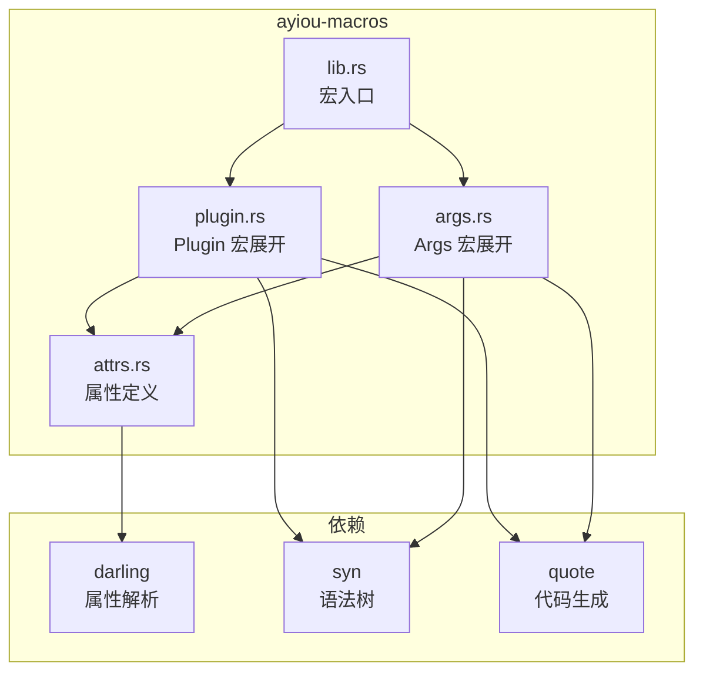

# ayiou-macros - 派生宏库

[← 返回根目录](../CLAUDE.md)

**最后更新**: 2025-12-15 21:16:40

## 变更日志 (Changelog)

### 2025-12-15
- 更新文档，添加面包屑导航和更新时间戳

### 2025-12-14
- 初始版本发布
- 实现 `#[derive(Plugin)]` 和 `#[derive(Args)]` 派生宏
- 基于 darling 实现属性解析
- 支持多种命名规则和字段验证

## 模块概述

`ayiou-macros` 是 Ayiou 框架的过程宏库，提供 `#[derive(Plugin)]` 和 `#[derive(Args)]` 两个派生宏，用于声明式地定义机器人命令和参数解析。

## 职责

- 解析 `#[plugin(...)]` 和 `#[arg(...)]` 属性
- 为枚举类型生成 `Plugin` trait 实现
- 为结构体类型生成 `Args` trait 实现
- 自动生成命令匹配、解析和帮助文本

## 架构



## 关键接口

### #[derive(Plugin)]

为枚举类型生成完整的插件实现：

```rust
#[derive(Plugin)]
#[plugin(
    prefix = "/",           // 命令前缀
    name = "my-plugin",     // 插件名称
    description = "描述",   // 插件描述
    version = "1.0.0",      // 版本号
    rename_rule = "lowercase"  // 命名规则
)]
pub enum MyCommands {
    #[plugin(description = "帮助", alias = "h")]
    Help,

    #[plugin(description = "回显", aliases = ["e", "echo"])]
    Echo(EchoArgs),

    #[plugin(hide)]  // 隐藏命令
    Admin { text: String },
}
```

**生成的方法**:
- `matches_cmd(text: &str) -> bool` - 检查文本是否匹配命令
- `try_parse(text: &str) -> Result<Self, ArgsParseError>` - 解析命令
- `descriptions() -> &'static [(&'static str, &'static str)]` - 命令描述列表
- `help_text() -> String` - 帮助文本
- `impl Plugin for ...` - 完整的 Plugin trait 实现

### #[derive(Args)]

为结构体生成参数解析实现：

```rust
#[derive(Args)]
#[arg(usage = "/echo <text>")]
pub struct EchoArgs {
    #[arg(rest)]           // 消费剩余所有输入
    pub text: String,
}

#[derive(Args)]
pub struct ScheduleArgs {
    #[arg(cron, error = "无效的 cron 表达式")]
    pub schedule: CronSchedule,
}

#[derive(Args)]
pub struct ValidatedArgs {
    #[arg(regex = r"^\d{4}$", error = "必须是4位数字")]
    pub code: String,

    #[arg(optional)]
    pub note: Option<String>,
}
```

**字段属性**:
- `rest` - 消费剩余所有输入
- `cron` - 解析为 CronSchedule
- `regex = "pattern"` - 正则验证
- `optional` - 可选字段
- `error = "msg"` - 自定义错误消息

## 文件说明

| 文件 | 行数 | 说明 |
|------|------|------|
| `src/lib.rs` | ~83 | 宏入口，文档和示例 |
| `src/plugin.rs` | ~270 | Plugin 宏展开逻辑 |
| `src/args.rs` | ~210 | Args 宏展开逻辑 |
| `src/attrs.rs` | ~102 | 属性结构定义，命名规则 |

## 属性结构

### PluginAttrs (枚举级)

```rust
pub struct PluginAttrs {
    pub ident: syn::Ident,
    pub name: Option<String>,
    pub prefix: Option<String>,
    pub rename_rule: Option<RenameRule>,
    pub description: Option<String>,
    pub version: Option<String>,
}
```

### VariantAttrs (变体级)

```rust
pub struct VariantAttrs {
    pub ident: syn::Ident,
    pub fields: Fields<syn::Field>,
    pub description: Option<String>,
    pub alias: Option<String>,
    pub aliases: Vec<String>,
    pub rename: Option<String>,
    pub hide: bool,
}
```

### ArgFieldAttrs (字段级)

```rust
pub struct ArgFieldAttrs {
    pub ident: Option<syn::Ident>,
    pub ty: syn::Type,
    pub regex: Option<String>,
    pub cron: bool,
    pub rest: bool,
    pub optional: bool,
    pub error: Option<String>,
}
```

## 命名规则

支持的 `rename_rule` 值：

| 规则 | 示例 |
|------|------|
| `lowercase` (默认) | `MyCommand` → `mycommand` |
| `UPPERCASE` | `MyCommand` → `MYCOMMAND` |
| `snake_case` | `MyCommand` → `my_command` |
| `camelCase` | `MyCommand` → `myCommand` |
| `PascalCase` | `MyCommand` → `MyCommand` |
| `kebab-case` | `MyCommand` → `my-command` |

## 依赖

```toml
[dependencies]
darling = "0.20"      # 属性解析框架
proc-macro2 = "1"     # 过程宏工具
quote = "1"           # 代码生成
syn = { version = "2", features = ["full", "extra-traits"] }
```

## 生成代码示例

输入：

```rust
#[derive(Plugin)]
#[plugin(prefix = "/")]
pub enum Cmds {
    #[plugin(description = "帮助")]
    Help,
    #[plugin(description = "回显")]
    Echo(EchoArgs),
}
```

生成（简化）：

```rust
impl Default for Cmds {
    fn default() -> Self { Self::Help }
}

impl Cmds {
    pub fn matches_cmd(text: &str) -> bool { ... }
    pub fn try_parse(text: &str) -> Result<Self, ArgsParseError> { ... }
    pub fn descriptions() -> &'static [(&'static str, &'static str)] {
        &[("/help", "帮助"), ("/echo", "回显")]
    }
    pub fn help_text() -> String { ... }
}

#[async_trait]
impl Plugin for Cmds {
    fn meta(&self) -> PluginMetadata { ... }
    fn matches(&self, ctx: &Ctx) -> bool {
        Self::matches_cmd(&ctx.text())
    }
    async fn handle(&self, ctx: &Ctx) -> Result<bool> {
        match Self::try_parse(&ctx.text()) {
            Ok(cmd) => match cmd {
                Self::Help => Ok(true),
                Self::Echo(inner) => {
                    inner.handle(ctx).await?;
                    Ok(true)
                }
            },
            Err(e) => {
                ctx.reply_text(format!("❌ {}", e)).await?;
                Ok(true)
            }
        }
    }
}
```

## 扩展点

- 添加新的字段属性：修改 `ArgFieldAttrs` 和 `expand_args`
- 添加新的命名规则：修改 `RenameRule` 枚举
- 自定义错误处理：修改 `gen_handle_arms` 中的错误分支

## 相关文档

- [ayiou 核心库](../ayiou/CLAUDE.md)
- [根目录文档](../CLAUDE.md)
