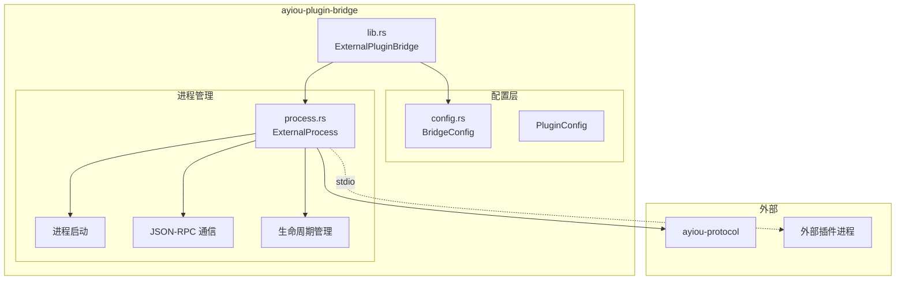
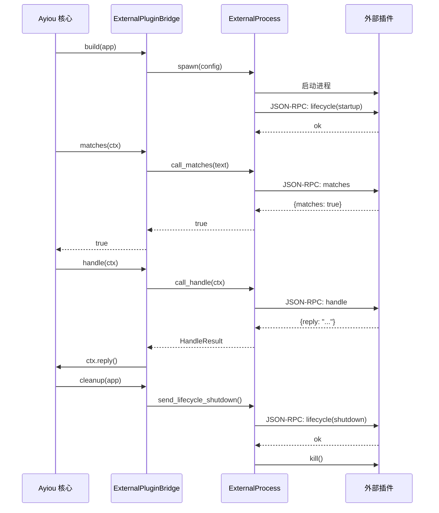

# ayiou-plugin-bridge - 多语言外部插件桥接

[← 返回根目录](../CLAUDE.md)

**最后更新**: 2025-12-15 21:16:40

## 模块概述

`ayiou-plugin-bridge` 是 Ayiou 框架的外部插件桥接模块，使得开发者可以使用任意编程语言（Python、JavaScript、Go、Ruby 等）编写 Ayiou 插件。桥接模块通过 JSON-RPC 协议与外部进程通信，将外部插件无缝集成到 Ayiou 的插件系统中。

## 职责

- 启动和管理外部插件进程
- 通过 stdio 进行 JSON-RPC 通信
- 将外部插件桥接为 Ayiou 原生 `Plugin` trait
- 处理进程生命周期（启动、关闭、重启）
- 配置管理和插件发现

## 架构



## 工作原理



## 关键接口

### ExternalPluginBridge

主桥接插件，实现 `Plugin` trait：

```rust
pub struct ExternalPluginBridge {
    processes: Arc<RwLock<HashMap<String, ExternalProcess>>>,
}

impl Plugin for ExternalPluginBridge {
    fn meta(&self) -> PluginMetadata { ... }
    fn is_unique(&self) -> bool { true }
    async fn build(&self, app: &mut AppBuilder) -> Result<()> { ... }
    fn matches(&self, ctx: &Ctx) -> bool { true }
    async fn handle(&self, ctx: &Ctx) -> Result<bool> { ... }
    async fn cleanup(&self, app: &mut App) -> Result<()> { ... }
}
```

### ExternalProcess

单个外部插件进程管理：

```rust
pub struct ExternalProcess {
    child: Mutex<Child>,
    stdin: Mutex<ChildStdin>,
    stdout: Mutex<BufReader<ChildStdout>>,
    next_id: Mutex<u64>,
}

impl ExternalProcess {
    pub async fn spawn(config: &PluginConfig) -> Result<Self>;
    pub async fn call_matches(&self, text: &str) -> Result<bool>;
    pub async fn call_handle(&self, ctx: &Ctx) -> Result<HandleResult>;
    pub async fn send_lifecycle_startup(&self) -> Result<()>;
    pub async fn send_lifecycle_shutdown(&self) -> Result<()>;
    pub async fn kill(self) -> Result<()>;
}
```

### 配置类型

#### BridgeConfig
```rust
#[derive(Deserialize)]
pub struct BridgeConfig {
    pub enabled: bool,
    pub plugins: HashMap<String, PluginConfig>,
}

impl Configurable for BridgeConfig {
    const PREFIX: &'static str = "external-plugin-bridge";
}
```

#### PluginConfig
```rust
#[derive(Deserialize)]
pub struct PluginConfig {
    pub command: String,              // 执行命令 (e.g., "python3")
    pub args: Vec<String>,            // 命令参数
    pub cwd: Option<String>,          // 工作目录
    pub env: HashMap<String, String>, // 环境变量
    pub auto_restart: bool,           // 自动重启
    pub max_restarts: u32,            // 最大重启次数
}
```

## 文件说明

| 文件 | 行数 | 说明 |
|------|------|------|
| `src/lib.rs` | ~176 | ExternalPluginBridge 主实现 |
| `src/config.rs` | ~54 | 配置定义和解析 |
| `src/process.rs` | ~184 | 外部进程管理和 JSON-RPC 通信 |
| `examples/demo.rs` | ~77 | 桥接示例和测试 |

## 配置示例

### config.toml

```toml
[external-plugin-bridge]
enabled = true

# Python 插件示例
[external-plugin-bridge.plugins.weather]
command = "python3"
args = ["plugins/weather.py"]
cwd = "/path/to/plugins"
auto_restart = true
max_restarts = 3

[external-plugin-bridge.plugins.weather.env]
API_KEY = "your-api-key"
LOG_LEVEL = "info"

# Node.js 插件示例
[external-plugin-bridge.plugins.chatgpt]
command = "node"
args = ["plugins/chatgpt/index.js"]

# Go 插件示例
[external-plugin-bridge.plugins.image]
command = "./plugins/image-generator"
args = ["--config", "config.yaml"]

# UV (Python 包管理器) 示例
[external-plugin-bridge.plugins.dalle]
command = "uv"
args = ["run", "ayiou-plugin-dalle"]
```

## 使用方式

### 1. 在 AyiouBot 中使用

```rust
use ayiou::prelude::*;
use ayiou_plugin_bridge::ExternalPluginBridge;

#[tokio::main]
async fn main() -> Result<()> {
    let mut builder = AppBuilder::new();

    // 加载配置
    builder = builder.config_file("config.toml")?;

    // 添加外部插件桥接
    builder.add_plugin(ExternalPluginBridge::new())?;

    // 构建并运行
    let mut app = builder.build().await?;

    // ... 运行逻辑

    app.shutdown().await?;
    Ok(())
}
```

### 2. 使用 ayiou-runner

```bash
# 创建 config.toml 配置文件
cat > config.toml << EOF
[external-plugin-bridge]
enabled = true

[external-plugin-bridge.plugins.mybot]
command = "python3"
args = ["my_plugin.py"]
EOF

# 运行
cargo run -p ayiou-runner
```

## 外部插件开发

### Python 插件模板

```python
#!/usr/bin/env python3
import json
import sys

class MyPlugin:
    def __init__(self):
        # 初始化资源
        pass

    def metadata(self):
        return {
            "name": "my-plugin",
            "description": "My awesome plugin",
            "version": "1.0.0",
            "commands": [
                {
                    "name": "mycommand",
                    "description": "Do something",
                    "aliases": ["mc"]
                }
            ]
        }

    def matches(self, params):
        # 检查是否匹配
        text = params["text"]
        return {"matches": text.startswith("/mycommand")}

    def handle(self, params):
        # 处理消息
        text = params["text"]
        # ... 业务逻辑
        return {
            "handled": True,
            "block": True,
            "reply": "处理结果"
        }

    def lifecycle(self, params):
        event = params["event"]
        if "startup" in event:
            # 启动初始化
            print("Starting up!", file=sys.stderr)
        elif "shutdown" in event:
            # 清理资源
            print("Shutting down!", file=sys.stderr)
        return {"ok": True}

def main():
    plugin = MyPlugin()

    # JSON-RPC 主循环
    for line in sys.stdin:
        try:
            req = json.loads(line)
            method = req["method"]
            params = req.get("params", {})

            # 路由到对应方法
            if method == "metadata":
                result = plugin.metadata()
            elif method == "matches":
                result = plugin.matches(params)
            elif method == "handle":
                result = plugin.handle(params)
            elif method == "lifecycle":
                result = plugin.lifecycle(params)
            else:
                raise Exception(f"Unknown method: {method}")

            # 返回响应
            response = {
                "jsonrpc": "2.0",
                "result": result,
                "id": req["id"]
            }
            print(json.dumps(response), flush=True)

        except Exception as e:
            # 错误响应
            error_response = {
                "jsonrpc": "2.0",
                "error": {
                    "code": -32603,
                    "message": str(e)
                },
                "id": req.get("id", 0)
            }
            print(json.dumps(error_response), flush=True)

if __name__ == "__main__":
    main()
```

### JavaScript (Node.js) 插件模板

```javascript
#!/usr/bin/env node
const readline = require('readline');

class MyPlugin {
  constructor() {
    // 初始化
  }

  metadata() {
    return {
      name: "my-plugin",
      description: "My awesome plugin",
      version: "1.0.0",
      commands: [
        {
          name: "mycommand",
          description: "Do something",
          aliases: ["mc"]
        }
      ]
    };
  }

  matches(params) {
    return { matches: params.text.startsWith("/mycommand") };
  }

  handle(params) {
    // 业务逻辑
    return {
      handled: true,
      block: true,
      reply: "处理结果"
    };
  }

  lifecycle(params) {
    if (params.event.startup !== undefined) {
      console.error("Starting up!");
    } else if (params.event.shutdown !== undefined) {
      console.error("Shutting down!");
    }
    return { ok: true };
  }
}

const plugin = new MyPlugin();
const rl = readline.createInterface({
  input: process.stdin,
  output: process.stdout,
  terminal: false
});

rl.on('line', (line) => {
  try {
    const req = JSON.parse(line);
    let result;

    switch (req.method) {
      case "metadata": result = plugin.metadata(); break;
      case "matches": result = plugin.matches(req.params || {}); break;
      case "handle": result = plugin.handle(req.params || {}); break;
      case "lifecycle": result = plugin.lifecycle(req.params || {}); break;
      default: throw new Error(`Unknown method: ${req.method}`);
    }

    console.log(JSON.stringify({
      jsonrpc: "2.0",
      result: result,
      id: req.id
    }));
  } catch (e) {
    console.log(JSON.stringify({
      jsonrpc: "2.0",
      error: { code: -32603, message: e.message },
      id: req.id || 0
    }));
  }
});
```

## 依赖

```toml
[dependencies]
ayiou = { path = "../ayiou" }
ayiou-protocol = { path = "../ayiou-protocol" }
async-trait = "0.1"
anyhow = "1.0"
serde = { version = "1.0", features = ["derive"] }
serde_json = "1.0"
tokio = { version = "1.0", features = ["process", "io-util", "sync"] }
tracing = "0.1"
```

## 特性

### 1. 进程隔离
- 每个外部插件运行在独立进程中
- 插件崩溃不影响主程序和其他插件
- 支持自动重启（可配置）

### 2. 多语言支持
- 支持任何能读写 stdio 的语言
- 已测试：Python、JavaScript (Node.js)
- 理论支持：Go、Ruby、PHP、Shell 等

### 3. 生命周期管理
- 自动发送 startup 事件
- 优雅关闭（shutdown 事件）
- 超时强制终止

### 4. 并发处理
- 支持多个外部插件同时运行
- 异步 JSON-RPC 通信
- 线程安全的进程管理

### 5. 配置灵活
- TOML 配置文件
- 支持环境变量注入
- 可配置工作目录
- 自动重启策略

## 调试技巧

### 1. 日志输出
外部插件通过 stderr 输出调试信息：
```python
print("Debug info", file=sys.stderr)
```

### 2. 测试单个插件
```bash
# 手动运行插件，测试 JSON-RPC
echo '{"jsonrpc":"2.0","method":"metadata","params":{},"id":1}' | python3 my_plugin.py
```

### 3. 启用详细日志
```bash
RUST_LOG=debug cargo run -p ayiou-runner
```

### 4. 检查进程状态
```bash
ps aux | grep python  # 查看插件进程
```

## 限制与注意事项

### 1. 性能考虑
- 进程间通信有开销，不适合高频调用
- 建议在 `matches()` 中使用简单判断
- 重型计算放在 `handle()` 中

### 2. 通信规范
- 必须严格遵循 JSON-RPC 2.0 格式
- 每行一个 JSON 对象
- 必须立即 flush 输出

### 3. 资源管理
- 正确处理 shutdown 信号
- 避免资源泄漏
- 超时后会被强制终止

### 4. 错误处理
- 插件崩溃会被记录但不影响主程序
- 可配置自动重启
- 使用标准 JSON-RPC 错误码

## 最佳实践

1. **单一职责**: 每个插件专注一个功能
2. **快速响应**: matches 应尽快返回
3. **错误恢复**: 实现错误处理和重试逻辑
4. **日志规范**: 使用 stderr 输出调试信息
5. **版本管理**: 在 metadata 中标明版本号
6. **配置验证**: 启动时验证必需的配置项

## 相关文档

- [ayiou-protocol 协议规范](../ayiou-protocol/CLAUDE.md)
- [外部插件示例](../examples/)
- [ayiou 核心库](../ayiou/CLAUDE.md)
