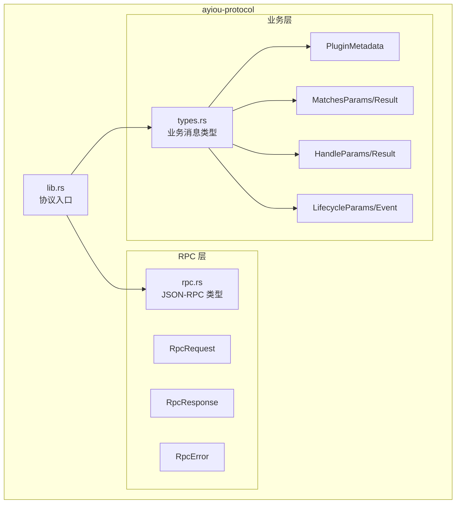

# ayiou-protocol - 外部插件 JSON-RPC 协议

[← 返回根目录](../CLAUDE.md)

**最后更新**: 2025-12-15 21:16:40

## 模块概述

`ayiou-protocol` 定义了 Ayiou 核心与外部插件之间通信的 JSON-RPC 2.0 协议规范。该协议使得外部插件可以使用任意编程语言实现（Python、JavaScript、Go、Ruby 等），只需通过 stdio 进行 JSON-RPC 通��即可。

## 职责

- 定义 JSON-RPC 请求和响应格式
- 定义插件元数据、匹配、处理和生命周期方法的参数和返回值类型
- 提供标准 RPC 错误码
- 作为外部插件开发的协议规范参考

## 架构



## 协议概览

### 通信方式
- **传输层**: stdio (标准输入/输出)
- **格式**: 每行一个 JSON 对象
- **编码**: UTF-8
- **协议**: JSON-RPC 2.0

### 方法列表

| 方法 | 说明 | 参数 | 返回值 |
|------|------|------|--------|
| `metadata` | 获取插件元数据 | 无 | `PluginMetadata` |
| `matches` | 检查插件是否匹配事件 | `MatchesParams` | `MatchesResult` |
| `handle` | 处理匹配的事件 | `HandleParams` | `HandleResult` |
| `lifecycle` | 生命周期事件通知 | `LifecycleParams` | `LifecycleResult` |

## 关键接口

### RPC 基础类型

#### RpcRequest
```rust
pub struct RpcRequest {
    pub jsonrpc: String,      // "2.0"
    pub method: String,       // 方法名
    pub params: Value,        // 参数（JSON）
    pub id: u64,             // 请求 ID
}
```

#### RpcResponse
```rust
pub struct RpcResponse {
    pub jsonrpc: String,           // "2.0"
    pub result: Option<Value>,     // 成功结果
    pub error: Option<RpcError>,   // 错误信息
    pub id: u64,                  // 请求 ID
}
```

#### RpcError
```rust
pub struct RpcError {
    pub code: i32,           // 错误码
    pub message: String,     // 错误消息
    pub data: Option<Value>, // 附加数据
}
```

**标准错误码**:
- `-32700`: Parse error (解析错误)
- `-32600`: Invalid Request (无效请求)
- `-32601`: Method not found (方法不存在)
- `-32602`: Invalid params (参数无效)
- `-32603`: Internal error (内部错误)

### 业务类型

#### PluginMetadata - 插件元数据
```rust
pub struct PluginMetadata {
    pub name: String,           // 插件名称
    pub description: String,    // 描述
    pub version: String,        // 版本号
    pub author: Option<String>, // 作者
    pub commands: Vec<CommandInfo>, // 命令列表
}

pub struct CommandInfo {
    pub name: String,          // 命令名
    pub description: String,   // 描述
    pub aliases: Vec<String>,  // 别名
}
```

#### MatchesParams/Result - 匹配检查
```rust
pub struct MatchesParams {
    pub text: String,               // 消息文本
    pub message_type: String,       // "private" 或 "group"
    pub user_id: Option<i64>,       // 用户 ID
    pub group_id: Option<i64>,      // 群 ID
}

pub struct MatchesResult {
    pub matches: bool,  // 是否匹配
}
```

#### HandleParams/Result - 事件处理
```rust
pub struct HandleParams {
    pub message_type: String,  // 消息类型
    pub user_id: i64,         // 用户 ID
    pub group_id: Option<i64>, // 群 ID（私聊为 None）
    pub text: String,         // 纯文本
    pub raw_message: String,  // 原始消息
    pub self_id: Option<i64>, // 机器人 QQ
}

pub struct HandleResult {
    pub handled: bool,             // 是否已处理
    pub block: bool,              // 是否阻止后续处理器
    pub reply: Option<String>,    // 回复文本（简便方式）
    pub actions: Vec<Action>,     // 结构化操作
}

pub enum Action {
    Reply { text: String },
    Image { url: String },
    Send { target_type: String, target_id: i64, message: String },
}
```

#### LifecycleParams/Event - 生命周期
```rust
pub struct LifecycleParams {
    pub event: LifecycleEvent,
}

pub enum LifecycleEvent {
    Startup,                    // 启动
    Shutdown,                   // 关闭
    BotConnect { self_id: i64 }, // 机器人连接
}

pub struct LifecycleResult {
    pub ok: bool,  // 确认收到
}
```

## 文件说明

| 文件 | 行数 | 说明 |
|------|------|------|
| `src/lib.rs` | ~28 | 协议入口，导出所有类型和常量 |
| `src/rpc.rs` | ~115 | JSON-RPC 2.0 基础类型定义 |
| `src/types.rs` | ~185 | 业务层消息类型定义 |

## 协议示例

### metadata - 获取插件信息

**请求**:
```json
{
  "jsonrpc": "2.0",
  "method": "metadata",
  "params": {},
  "id": 1
}
```

**响应**:
```json
{
  "jsonrpc": "2.0",
  "result": {
    "name": "weather",
    "description": "天气查询插件",
    "version": "1.0.0",
    "author": "Your Name",
    "commands": [
      {
        "name": "weather",
        "description": "查询天气",
        "aliases": ["天气"]
      }
    ]
  },
  "id": 1
}
```

### matches - 检查匹配

**请求**:
```json
{
  "jsonrpc": "2.0",
  "method": "matches",
  "params": {
    "text": "/weather Beijing",
    "message_type": "private",
    "user_id": 123456,
    "group_id": null
  },
  "id": 2
}
```

**响应**:
```json
{
  "jsonrpc": "2.0",
  "result": {
    "matches": true
  },
  "id": 2
}
```

### handle - 处理事件

**请求**:
```json
{
  "jsonrpc": "2.0",
  "method": "handle",
  "params": {
    "message_type": "private",
    "user_id": 123456,
    "group_id": null,
    "text": "/weather Beijing",
    "raw_message": "/weather Beijing",
    "self_id": 987654
  },
  "id": 3
}
```

**响应（简单文本回复）**:
```json
{
  "jsonrpc": "2.0",
  "result": {
    "handled": true,
    "block": true,
    "reply": "北京天气：晴，温度 25°C"
  },
  "id": 3
}
```

**响应（结构化操作）**:
```json
{
  "jsonrpc": "2.0",
  "result": {
    "handled": true,
    "block": true,
    "reply": null,
    "actions": [
      {
        "type": "reply",
        "text": "北京天气："
      },
      {
        "type": "image",
        "url": "https://example.com/weather.png"
      }
    ]
  },
  "id": 3
}
```

### lifecycle - 生命周期事件

**启动通知**:
```json
{
  "jsonrpc": "2.0",
  "method": "lifecycle",
  "params": {
    "event": {
      "startup": null
    }
  },
  "id": 4
}
```

**关闭通知**:
```json
{
  "jsonrpc": "2.0",
  "method": "lifecycle",
  "params": {
    "event": {
      "shutdown": null
    }
  },
  "id": 5
}
```

**响应**:
```json
{
  "jsonrpc": "2.0",
  "result": {
    "ok": true
  },
  "id": 4
}
```

## 外部插件实现指南

### Python 示例（完整）

```python
#!/usr/bin/env python3
import json
import sys

class WeatherPlugin:
    def metadata(self):
        return {
            "name": "weather",
            "description": "天气查询插件",
            "version": "1.0.0",
            "commands": [
                {"name": "weather", "description": "查询天气", "aliases": []}
            ]
        }

    def matches(self, params):
        return {"matches": params["text"].startswith("/weather")}

    def handle(self, params):
        city = params["text"].replace("/weather", "").strip()
        return {
            "handled": True,
            "block": True,
            "reply": f"{city}天气：晴，25°C"
        }

    def lifecycle(self, params):
        event = params["event"]
        if "startup" in event:
            print("Plugin started!", file=sys.stderr)
        elif "shutdown" in event:
            print("Plugin shutting down!", file=sys.stderr)
        return {"ok": True}

def main():
    plugin = WeatherPlugin()

    for line in sys.stdin:
        try:
            req = json.loads(line)
            method = req["method"]
            params = req.get("params", {})

            if method == "metadata":
                result = plugin.metadata()
            elif method == "matches":
                result = plugin.matches(params)
            elif method == "handle":
                result = plugin.handle(params)
            elif method == "lifecycle":
                result = plugin.lifecycle(params)
            else:
                result = None

            response = {
                "jsonrpc": "2.0",
                "result": result,
                "id": req["id"]
            }
            print(json.dumps(response), flush=True)
        except Exception as e:
            error_response = {
                "jsonrpc": "2.0",
                "error": {
                    "code": -32603,
                    "message": str(e)
                },
                "id": req.get("id", 0)
            }
            print(json.dumps(error_response), flush=True)

if __name__ == "__main__":
    main()
```

### JavaScript (Node.js) 示例

```javascript
#!/usr/bin/env node
const readline = require('readline');

class WeatherPlugin {
  metadata() {
    return {
      name: "weather",
      description: "天气查询插件",
      version: "1.0.0",
      commands: [
        { name: "weather", description: "查询天气", aliases: [] }
      ]
    };
  }

  matches(params) {
    return { matches: params.text.startsWith("/weather") };
  }

  handle(params) {
    const city = params.text.replace("/weather", "").trim();
    return {
      handled: true,
      block: true,
      reply: `${city}天气：晴，25°C`
    };
  }

  lifecycle(params) {
    if (params.event.startup !== undefined) {
      console.error("Plugin started!");
    } else if (params.event.shutdown !== undefined) {
      console.error("Plugin shutting down!");
    }
    return { ok: true };
  }
}

const plugin = new WeatherPlugin();
const rl = readline.createInterface({
  input: process.stdin,
  output: process.stdout,
  terminal: false
});

rl.on('line', (line) => {
  try {
    const req = JSON.parse(line);
    let result;

    switch (req.method) {
      case "metadata":
        result = plugin.metadata();
        break;
      case "matches":
        result = plugin.matches(req.params || {});
        break;
      case "handle":
        result = plugin.handle(req.params || {});
        break;
      case "lifecycle":
        result = plugin.lifecycle(req.params || {});
        break;
      default:
        result = null;
    }

    const response = {
      jsonrpc: "2.0",
      result: result,
      id: req.id
    };
    console.log(JSON.stringify(response));
  } catch (e) {
    const errorResponse = {
      jsonrpc: "2.0",
      error: {
        code: -32603,
        message: e.message
      },
      id: req.id || 0
    };
    console.log(JSON.stringify(errorResponse));
  }
});
```

## 依赖

```toml
[dependencies]
serde = { version = "1.0", features = ["derive"] }
serde_json = "1.0"
```

## 最佳实践

### 1. 错误处理
- 始终使用标准 JSON-RPC 错误码
- 在 `error.data` 中提供详细错误信息
- 外部插件错误通过 stderr 输出调试信息

### 2. 性能优化
- 避免在 `matches()` 中执行重型操作
- 使用简单的字符串前缀/正则匹配
- 重型计算放在 `handle()` 中

### 3. 生命周期管理
- 在 `startup` 中初始化资源（数据库连接、缓存等）
- 在 `shutdown` 中清理资源
- 优雅处理 shutdown 信号

### 4. 通信规范
- 每行一个完整的 JSON 对象
- 使用 `flush=True` (Python) 或 `console.log` (Node.js) 确保立即输出
- 调试信息输出到 stderr，避免污染 stdout

### 5. 版本兼容性
- 在 metadata 中明确声明版本号
- 遵循语义化版本规范
- 向后兼容旧的协议版本

## 版本历史

### v1.0.0 (2025-12-15)
- 初始协议发布
- 支持 `metadata`, `matches`, `handle`, `lifecycle` 方法
- 定义标准 JSON-RPC 2.0 格式

## 相关链接

- [JSON-RPC 2.0 规范](https://www.jsonrpc.org/specification)
- [ayiou-plugin-bridge 文档](../ayiou-plugin-bridge/CLAUDE.md)
- [外部插件示例](../examples/)
