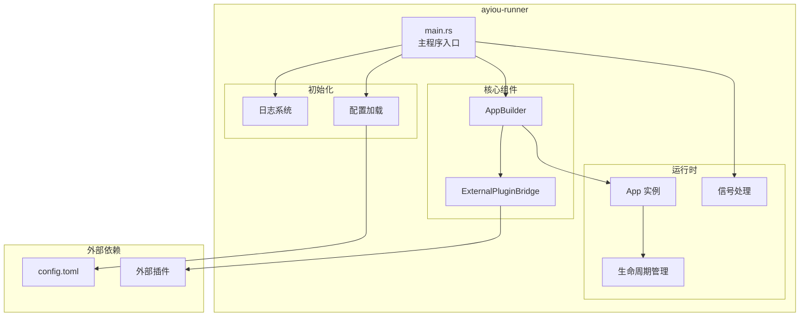
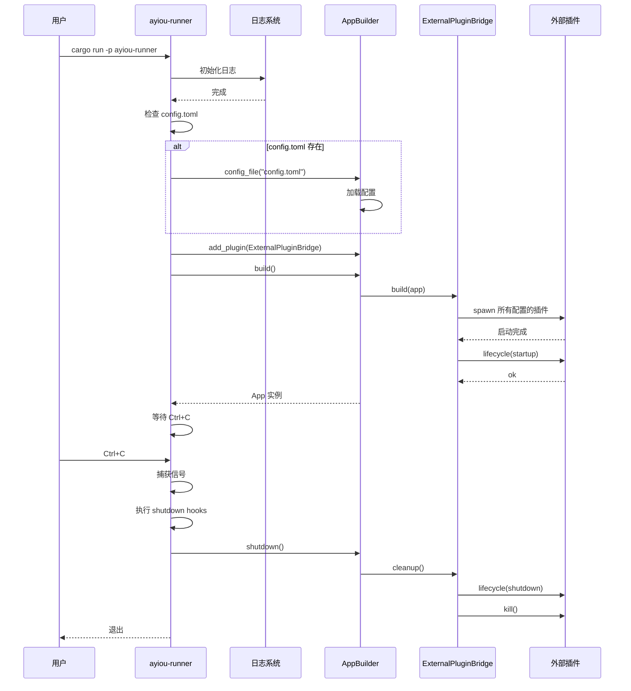

# ayiou-runner - 完整机器人运行器

[← 返回根目录](../CLAUDE.md)

**最后更新**: 2025-12-15 21:16:40

## 模块概述

`ayiou-runner` 是 Ayiou 框架的开箱即用运行器，提供了一个完整的机器人应用程序。它集成了外部插件桥接支持，可以通过配置文件加载和管理多个外部插件，无需编写额外代码。

## 职责

- 提供完整的可执行程序（`ayiou-bot`）
- 自动加载配置文件 (`config.toml`)
- 集成 `ExternalPluginBridge` 支持多语言插件
- 处理应用生命周期和优雅关闭
- 配置日志系统

## 架构



## 工作流程



## 关键代码

### main.rs (完整)

```rust
use anyhow::Result;
use ayiou::prelude::*;
use tracing::{info, Level};

#[tokio::main]
async fn main() -> Result<()> {
    // 初始化日志系统
    tracing_subscriber::fmt()
        .with_max_level(Level::INFO)
        .init();

    info!("Starting Ayiou Bot...");

    use ayiou_plugin_bridge::ExternalPluginBridge;

    let mut builder = AppBuilder::new();

    // 加载配置文件（如果存在）
    if std::path::Path::new("config.toml").exists() {
        info!("Loading config.toml");
        builder = builder.config_file("config.toml")?;
    }

    // 添加外部插件桥接
    builder.add_plugin(ExternalPluginBridge::new())?;

    // 构建应用
    let mut app = builder.build().await?;

    info!("App running. Ctrl+C to stop.");

    // 等待 Ctrl+C 信号
    tokio::signal::ctrl_c().await?;

    info!("Shutting down...");

    // 触发全局 shutdown hooks
    get_driver().read().await.run_shutdown_hooks().await;

    // 关闭应用（调用插件 cleanup）
    app.shutdown().await?;

    Ok(())
}
```

## 使用方式

### 1. 基本使用

```bash
# 构建
cargo build -p ayiou-runner

# 运行
cargo run -p ayiou-runner

# 发布构建
cargo build -p ayiou-runner --release
./target/release/ayiou-bot
```

### 2. 配置文件

在运行目录创建 `config.toml`：

```toml
# 外部插件桥接配置
[external-plugin-bridge]
enabled = true

# Python 天气插件
[external-plugin-bridge.plugins.weather]
command = "python3"
args = ["plugins/weather.py"]

# Node.js ChatGPT 插件
[external-plugin-bridge.plugins.chatgpt]
command = "node"
args = ["plugins/chatgpt/index.js"]

[external-plugin-bridge.plugins.chatgpt.env]
OPENAI_API_KEY = "sk-..."

# Go 图片生成插件
[external-plugin-bridge.plugins.image]
command = "./plugins/image-generator"
args = ["--config", "config.yaml"]
auto_restart = true
max_restarts = 3
```

### 3. 日志配置

通过环境变量控制日志级别：

```bash
# DEBUG 级别
RUST_LOG=debug cargo run -p ayiou-runner

# 特定模块 DEBUG
RUST_LOG=ayiou_plugin_bridge=debug cargo run -p ayiou-runner

# TRACE 级别（最详细）
RUST_LOG=trace cargo run -p ayiou-runner
```

### 4. 生产部署

```bash
# 构建发布版本
cargo build -p ayiou-runner --release

# 复制二进制文件
cp target/release/ayiou-bot /usr/local/bin/

# 创建配置目录
mkdir -p /etc/ayiou
cp config.toml /etc/ayiou/

# 运行
cd /etc/ayiou
ayiou-bot
```

## 文件说明

| 文件 | 行数 | 说明 |
|------|------|------|
| `src/main.rs` | ~40 | 主程序入口，完整的运行时逻辑 |
| `Cargo.toml` | ~17 | 依赖配置，定义二进制名称 |

## 配置项说明

### external-plugin-bridge 配置

| 字段 | 类型 | 必需 | 说明 |
|------|------|------|------|
| `enabled` | bool | 否 | 是否启用外部插件桥接，默认 false |
| `plugins` | map | 否 | 插件配置映射 |

### 插件配置 (plugins.<name>)

| 字段 | 类型 | 必需 | 说明 |
|------|------|------|------|
| `command` | string | 是 | 执行命令（如 "python3", "node"） |
| `args` | array | 否 | 命令参数 |
| `cwd` | string | 否 | 工作目录 |
| `env` | map | 否 | 环境变量 |
| `auto_restart` | bool | 否 | 是否自动重启，默认 false |
| `max_restarts` | int | 否 | 最大重启次数，默认 3 |

## 依赖

```toml
[dependencies]
ayiou = { path = "../ayiou" }
ayiou-plugin-bridge = { path = "../ayiou-plugin-bridge" }
tokio = { version = "1.0", features = ["full"] }
tracing = "0.1"
tracing-subscriber = "0.3"
anyhow = "1.0"
```

## 二进制配置

```toml
[[bin]]
name = "ayiou-bot"
path = "src/main.rs"
```

运行时会生成名为 `ayiou-bot` 的可执行文件。

## 使用场景

### 1. 快速开发测试

适合快速测试外部插件，无需编写额外的 Rust 代码：

```bash
# 1. 编写插件
vim plugins/my_plugin.py

# 2. 配置
vim config.toml

# 3. 运行
cargo run -p ayiou-runner
```

### 2. 生产环境部署

适合作为生产环境的主程序：

```bash
# 构建优化版本
cargo build -p ayiou-runner --release

# 部署
scp target/release/ayiou-bot user@server:/opt/ayiou/
scp config.toml user@server:/opt/ayiou/
scp -r plugins user@server:/opt/ayiou/

# 运行
ssh user@server
cd /opt/ayiou
./ayiou-bot
```

### 3. Docker 容器化

```dockerfile
FROM rust:1.75 as builder
WORKDIR /app
COPY . .
RUN cargo build -p ayiou-runner --release

FROM debian:bookworm-slim
RUN apt-get update && apt-get install -y python3 nodejs
WORKDIR /app
COPY --from=builder /app/target/release/ayiou-bot .
COPY config.toml .
COPY plugins/ ./plugins/
CMD ["./ayiou-bot"]
```

### 4. Systemd 服务

```ini
[Unit]
Description=Ayiou Bot
After=network.target

[Service]
Type=simple
User=ayiou
WorkingDirectory=/opt/ayiou
ExecStart=/opt/ayiou/ayiou-bot
Restart=always
RestartSec=10
Environment="RUST_LOG=info"

[Install]
WantedBy=multi-user.target
```

## 扩展示例

### 添加原生插件

如果需要添加原生 Rust 插件，可以修改 `main.rs`：

```rust
use ayiou::prelude::*;
use ayiou_plugin_bridge::ExternalPluginBridge;

// 定义原生插件
#[derive(Plugin)]
#[plugin(prefix = "/")]
pub enum NativeCommands {
    #[plugin(description = "原生帮助命令")]
    Help,

    #[plugin(description = "原生 ping")]
    Ping,
}

#[async_trait]
impl NativeCommands {
    async fn handle_help(&self, ctx: &Ctx) -> Result<()> {
        ctx.reply_text("原生命令列表...").await
    }

    async fn handle_ping(&self, ctx: &Ctx) -> Result<()> {
        ctx.reply_text("pong!").await
    }
}

#[tokio::main]
async fn main() -> Result<()> {
    // ... 初始化日志

    let mut builder = AppBuilder::new();

    // 加载配置
    if std::path::Path::new("config.toml").exists() {
        builder = builder.config_file("config.toml")?;
    }

    // 添加原生插件
    builder.add_plugin(NativeCommands::default())?;

    // 添加外部插件桥接
    builder.add_plugin(ExternalPluginBridge::new())?;

    let mut app = builder.build().await?;

    // ... 运行逻辑
    Ok(())
}
```

### 使用全局生命周期钩子

```rust
#[tokio::main]
async fn main() -> Result<()> {
    // ... 初始化

    // 注册全局钩子
    {
        let mut driver = get_driver().write().await;

        driver.on_startup(|| async {
            info!("应用启动完成！");
            // 可以在这里初始化全局资源
        });

        driver.on_shutdown(|| async {
            info!("应用正在关闭...");
            // 清理全局资源
        });
    }

    // ... 构建和运行
    Ok(())
}
```

## 常见问题

### Q: 配置文件路径如何指定？

A: 当前实现在当前工作目录查找 `config.toml`。可以修改 `main.rs` 支持命令行参数：

```rust
let config_path = std::env::args()
    .nth(1)
    .unwrap_or_else(|| "config.toml".to_string());

if std::path::Path::new(&config_path).exists() {
    builder = builder.config_file(&config_path)?;
}
```

### Q: 如何添加更多日志格式选项？

A: 修改 `tracing_subscriber` 初始化：

```rust
tracing_subscriber::fmt()
    .with_max_level(Level::INFO)
    .with_target(false)  // 不显示模块路径
    .with_thread_ids(true)  // 显示线程 ID
    .with_file(true)  // 显示文件名
    .json()  // JSON 格式输出
    .init();
```

### Q: 如何在不同环境使用不同配置？

A: 使用环境变量或配置文件切换：

```bash
# 开发环境
cp config.dev.toml config.toml
cargo run -p ayiou-runner

# 生产环境
cp config.prod.toml config.toml
./ayiou-bot
```

### Q: 如何处理插件热重载？

A: 当前版本不支持热重载，需要重启应用。未来可以通过监听文件变更实现。

## 监控和调试

### 日志查看

```bash
# 实时查看日志
cargo run -p ayiou-runner 2>&1 | tee bot.log

# 按级别过滤
RUST_LOG=warn cargo run -p ayiou-runner

# 查看特定模块
RUST_LOG=ayiou_runner=debug,ayiou_plugin_bridge=trace cargo run -p ayiou-runner
```

### 健康检查

可以添加简单的健康检查端点（需要修改代码）：

```rust
// 在 main.rs 中添加
tokio::spawn(async {
    let listener = tokio::net::TcpListener::bind("127.0.0.1:8081")
        .await
        .unwrap();
    loop {
        if let Ok((stream, _)) = listener.accept().await {
            let response = "HTTP/1.1 200 OK\r\n\r\n{\"status\":\"ok\"}";
            let _ = stream.writable().await;
            let _ = stream.try_write(response.as_bytes());
        }
    }
});
```

### 性能分析

```bash
# CPU profiling
cargo build -p ayiou-runner --release
perf record -g ./target/release/ayiou-bot
perf report

# 内存分析
valgrind --tool=massif ./target/release/ayiou-bot
```

## 最佳实践

1. **配置管理**: 使用版本控制管理配置模板，敏感信息用环境变量
2. **日志规范**: 生产环境使用 INFO 级别，调试时用 DEBUG
3. **优雅关闭**: 确保所有插件正确处理 shutdown 事件
4. **错误监控**: 集成 Sentry 或其他错误跟踪服务
5. **自动重启**: 使用 systemd 或 supervisor 管理进程
6. **资源限制**: 配置内存和 CPU 限制，防止资源耗尽

## 相关文档

- [ayiou 核心库](../ayiou/CLAUDE.md)
- [ayiou-plugin-bridge 桥接模块](../ayiou-plugin-bridge/CLAUDE.md)
- [ayiou-protocol 协议规范](../ayiou-protocol/CLAUDE.md)
