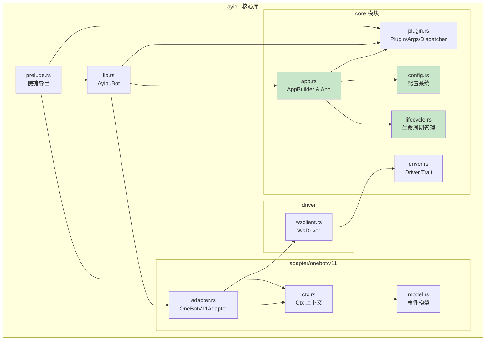

# ayiou - 核心运行时库

[← 返回根目录](../CLAUDE.md)

**最后更新**: 2025-12-15 21:16:40

## 变更日志 (Changelog)

### 2025-12-15
- 新增 `AppBuilder` 和 `App` 架构，支持插件生命周期管理
- 新增 `ResourceRegistry` 实现依赖注入
- 新增 `ConfigStore` 和 `Configurable` trait 实现类型安全配置
- 新增 `LifecycleDriver` 支持全局 `on_startup/on_shutdown` 钩子
- 新增 `Plugin::build()`, `ready()`, `finish()`, `cleanup()` 生命周期方法
- 新增 `Plugin::dependencies()` 支持插件依赖声明和拓扑排序

### 2025-12-14
- 初始版本，实现核心 Plugin 系统和 Dispatcher
- 实现 OneBot v11 适配器和完整事件模型
- 实现 WebSocket 驱动，支持自动重连
- 支持 `#[derive(Plugin)]` 和 `#[derive(Args)]` 宏

## 模块概述

`ayiou` 是 Ayiou 机器人框架的核心运行时库，提供了完整的 OneBot v11 协议支持、插件系统和消息处理能力。

## 职责

- 提供 `AyiouBot` 主入口，管理机器人生命周期
- 实现插件注册、匹配和分发机制
- 封装 OneBot v11 协议的事件模型和 API 调用
- 提供 WebSocket 传输层驱动
- 管理应用配置和资源依赖注入
- 协调插件生命周期（build → ready → finish → cleanup）

## 架构



## 关键接口

### Plugin Trait (增强版)

```rust
#[async_trait]
pub trait Plugin: Send + Sync + 'static {
    // 元数据
    fn meta(&self) -> PluginMetadata;

    // 是否唯一（同名插件只能注册一次）
    fn is_unique(&self) -> bool { true }

    // 依赖声明
    fn dependencies(&self) -> Vec<Dependency> { vec![] }

    // ===== 生命周期钩子 =====

    // 构建阶段（可访问 AppBuilder）
    async fn build(&self, app: &mut AppBuilder) -> Result<()> { Ok(()) }

    // 就绪检查
    fn ready(&self, app: &App) -> bool { true }

    // 完成初始化
    async fn finish(&self, app: &mut App) -> Result<()> { Ok(()) }

    // 清理资源
    async fn cleanup(&self, app: &mut App) -> Result<()> { Ok(()) }

    // ===== 消息处理 =====

    // 检查是否匹配消息
    fn matches(&self, ctx: &Ctx) -> bool;

    // 处理消息
    async fn handle(&self, ctx: &Ctx) -> Result<bool>;
}
```

### AppBuilder - 应用构建器

```rust
pub struct AppBuilder {
    config: ConfigStore,
    resources: ResourceRegistry,
    plugins: Vec<Arc<dyn Plugin>>,
    plugin_names: HashSet<String>,
}

impl AppBuilder {
    pub fn new() -> Self;
    pub fn config_file(self, path: impl AsRef<Path>) -> Result<Self>;
    pub fn add_plugin<P: Plugin>(&mut self, plugin: P) -> Result<&mut Self>;
    pub fn config<C: Configurable>(&self) -> Result<C>;
    pub fn insert_resource<R: Send + Sync + 'static>(&mut self, resource: R);
    pub fn get_resource<R: 'static>(&self) -> Option<&R>;
    pub async fn build(self) -> Result<App>;
}
```

### App - 应用运行时

```rust
pub struct App {
    config: ConfigStore,
    resources: ResourceRegistry,
    plugins: PluginList,
    state: AppState,
}

impl App {
    pub fn state(&self) -> AppState;
    pub fn config<C: Configurable>(&self) -> Result<C>;
    pub fn get_resource<R: 'static>(&self) -> Option<&R>;
    pub fn plugins(&self) -> &PluginList;
    pub async fn shutdown(&mut self) -> Result<()>;
}
```

### Configurable Trait

```rust
pub trait Configurable: DeserializeOwned + Default {
    const PREFIX: &'static str;
}

// 使用示例
#[derive(Deserialize, Default)]
pub struct MyConfig {
    pub timeout: u64,
}

impl Configurable for MyConfig {
    const PREFIX: &'static str = "my-plugin";
}
```

### LifecycleDriver - 全局钩子

```rust
pub fn get_driver() -> &'static RwLock<LifecycleDriver>;

// 使用示例
let mut driver = get_driver().write().await;
driver.on_startup(|| async {
    println!("应用启动！");
});
driver.on_shutdown(|| async {
    println!("应用关闭！");
});
```

### Args Trait

```rust
pub trait Args: Sized + Default {
    fn parse(args: &str) -> Result<Self, ArgsParseError>;
    fn usage() -> Option<&'static str>;
}
```

### Ctx (消息上下文)

```rust
impl Ctx {
    pub fn text(&self) -> String;           // 获取纯文本
    pub fn raw_message(&self) -> &str;      // 原始消息
    pub fn user_id(&self) -> i64;           // 发送者 ID
    pub fn group_id(&self) -> Option<i64>;  // 群 ID
    pub fn is_group(&self) -> bool;         // 是否群消息
    pub async fn reply(&self, msg: Message) -> Result<()>;
    pub async fn reply_text(&self, text: &str) -> Result<()>;
    // ... 更多 API 方法
}
```

## 文件说明

| 文件 | 行数 | 说明 |
|------|------|------|
| `src/lib.rs` | ~188 | AyiouBot 主结构，向后兼容的 API |
| `src/prelude.rs` | ~20 | 便捷导出，`use ayiou::prelude::*` |
| `src/core.rs` | ~10 | core 模块入口 |
| `src/core/app.rs` | ~480 | AppBuilder、App 和资源管理 |
| `src/core/config.rs` | ~296 | ConfigStore 和 Configurable trait |
| `src/core/lifecycle.rs` | ~188 | LifecycleDriver 全局钩子 |
| `src/core/plugin.rs` | ~400+ | Plugin trait、Dispatcher、元数据 |
| `src/core/driver.rs` | ~20 | Driver trait 定义 |
| `src/adapter.rs` | ~5 | adapter 模块入口 |
| `src/adapter/onebot/v11/adapter.rs` | ~90 | OneBot v11 适配器，事件解析 |
| `src/adapter/onebot/v11/ctx.rs` | ~240 | 消息上下文，API 调用封装 |
| `src/adapter/onebot/v11/model.rs` | ~510 | 完整的 OneBot v11 数据模型 |
| `src/driver/wsclient.rs` | ~100 | WebSocket 驱动，自动重连 |
| `examples/native_demo.rs` | ~149 | 原生插件生命周期示例 |

## 依赖关系

### 内部依赖

- `ayiou-macros`: 派生宏 (`Plugin`, `Args`)

### 外部依赖

```toml
tokio = { version = "1.48", features = ["full"] }
tokio-tungstenite = "0.28.0"
serde = { version = "1.0", features = ["derive"] }
serde_json = "1.0"
async-trait = "0.1"
anyhow = "1.0"
thiserror = "2.0"
tracing = "0.1"
tracing-subscriber = "0.3"
cron = "0.15"
regex = "1"
chrono = "0.4"
toml = "0.8"
once_cell = "1.21"
dashmap = "6.1"
futures = "0.3"
url = "2.5"
```

## 核心类型

### PluginMetadata
```rust
pub struct PluginMetadata {
    pub name: String,
    pub description: String,
    pub version: String,
}

impl PluginMetadata {
    pub fn new(name: impl Into<String>) -> Self;
    pub fn description(self, desc: impl Into<String>) -> Self;
    pub fn version(self, ver: impl Into<String>) -> Self;
}
```

### Dependency
```rust
pub struct Dependency {
    pub name: String,
    pub optional: bool,
}
```

### CronSchedule

用于定时任务的 cron 表达式解析：

```rust
let schedule = CronSchedule::parse("0 0 * * * *")?;
for next in schedule.upcoming().take(5) {
    println!("Next: {}", next);
}
```

### RegexValidated

正则验证的字符串包装：

```rust
let validated = RegexValidated::validate(input, r"^\d{4}-\d{2}-\d{2}$")?;
```

### ArgsParseError

参数解析错误，支持帮助信息：

```rust
ArgsParseError::new("缺少必需参数")
    .with_help("用法: /cmd <arg1> <arg2>")
```

## 事件模型

支持的 OneBot v11 事件类型：

- **消息事件**: 私聊消息、群聊消息
- **通知事件**: 群文件上传、管理员变动、成员增减、禁言、好友添加、消息撤回等
- **请求事件**: 好友请求、群请求
- **元事件**: 生命周期、心跳

## 使用示例

### 基础插件（手动实现）

```rust
use ayiou::prelude::*;

struct MyPlugin;

#[async_trait]
impl Plugin for MyPlugin {
    fn meta(&self) -> PluginMetadata {
        PluginMetadata::new("my-plugin")
            .description("我的插件")
            .version("1.0.0")
    }

    fn matches(&self, ctx: &Ctx) -> bool {
        ctx.text().starts_with("/my")
    }

    async fn handle(&self, ctx: &Ctx) -> Result<bool> {
        ctx.reply_text("Hello!").await?;
        Ok(true)
    }
}

#[tokio::main]
async fn main() {
    AyiouBot::new()
        .register_plugin(MyPlugin)
        .run("ws://127.0.0.1:8080")
        .await;
}
```

### 使用生命周期和依赖注入

```rust
use ayiou::prelude::*;

// 共享资源
struct DatabaseConnection {
    url: String,
}

// 依赖插件
struct DatabasePlugin;

#[async_trait]
impl Plugin for DatabasePlugin {
    fn meta(&self) -> PluginMetadata {
        PluginMetadata::new("database")
    }

    async fn build(&self, app: &mut AppBuilder) -> Result<()> {
        // 初始化并注入资源
        app.insert_resource(DatabaseConnection {
            url: "postgres://...".to_string(),
        });
        Ok(())
    }

    async fn handle(&self, _ctx: &Ctx) -> Result<bool> {
        Ok(false)
    }
}

// 主插件（依赖 database）
#[derive(Plugin)]
#[plugin(dependencies = "database")]
struct UserPlugin;

#[async_trait]
impl Plugin for UserPlugin {
    fn meta(&self) -> PluginMetadata {
        PluginMetadata::new("users")
    }

    async fn build(&self, app: &mut AppBuilder) -> Result<()> {
        // 访问依赖提供的资源
        let db = app.get_resource::<DatabaseConnection>()
            .expect("Database not initialized");
        println!("Database URL: {}", db.url);
        Ok(())
    }

    async fn handle(&self, ctx: &Ctx) -> Result<bool> {
        if ctx.text() == "users" {
            ctx.reply_text("用户列表...").await?;
            return Ok(true);
        }
        Ok(false)
    }
}

#[tokio::main]
async fn main() -> Result<()> {
    let mut builder = AppBuilder::new();

    // 插件会按依赖顺序自动排序
    builder.add_plugin(UserPlugin)?;     // 依赖 database
    builder.add_plugin(DatabasePlugin)?; // 被依赖

    let mut app = builder.build().await?;

    // 使用 app...
    Ok(())
}
```

### 使用配置系统

```rust
use ayiou::prelude::*;

#[derive(Deserialize, Default)]
struct MyConfig {
    api_key: String,
    timeout: u64,
}

impl Configurable for MyConfig {
    const PREFIX: &'static str = "my-plugin";
}

struct MyPlugin;

#[async_trait]
impl Plugin for MyPlugin {
    fn meta(&self) -> PluginMetadata {
        PluginMetadata::new("my-plugin")
    }

    async fn build(&self, app: &mut AppBuilder) -> Result<()> {
        let config: MyConfig = app.config()?;
        println!("API Key: {}", config.api_key);
        Ok(())
    }

    async fn handle(&self, _ctx: &Ctx) -> Result<bool> {
        Ok(false)
    }
}
```

配置文件 `config.toml`:
```toml
[my-plugin]
api_key = "your-key"
timeout = 30
```

### 使用全局钩子

```rust
use ayiou::prelude::*;

#[tokio::main]
async fn main() -> Result<()> {
    // 注册全局钩子
    {
        let mut driver = get_driver().write().await;

        driver.on_startup(|| async {
            println!("应用启动完成！");
        });

        driver.on_shutdown(|| async {
            println!("应用正在关闭...");
        });
    }

    // 启动应用
    AyiouBot::new()
        .plugin::<MyPlugin>()
        .run("ws://127.0.0.1:8080")
        .await;

    Ok(())
}
```

## 最佳实践

1. **依赖管理**: 使用 `dependencies()` 明确声明插件依赖
2. **资源共享**: 通过 `ResourceRegistry` 在插件间共享数据
3. **配置分离**: 使用 `Configurable` trait 实现类型安全配置
4. **生命周期**: 在 `build()` 初始化，`cleanup()` 清理
5. **错误处理**: 使用 `anyhow::Result` 统一错误处理
6. **异步优先**: 所有 I/O 操作使用 async/await
7. **日志规范**: 使用 `tracing` 记录结构化日志

## 相关文档

- [ayiou-macros 宏库](../ayiou-macros/CLAUDE.md)
- [ayiou-plugin-bridge 外部插件](../ayiou-plugin-bridge/CLAUDE.md)
- [根目录文档](../CLAUDE.md)
